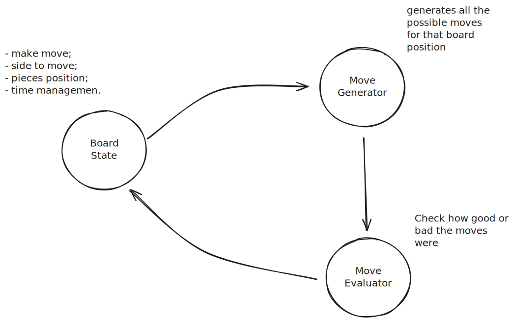
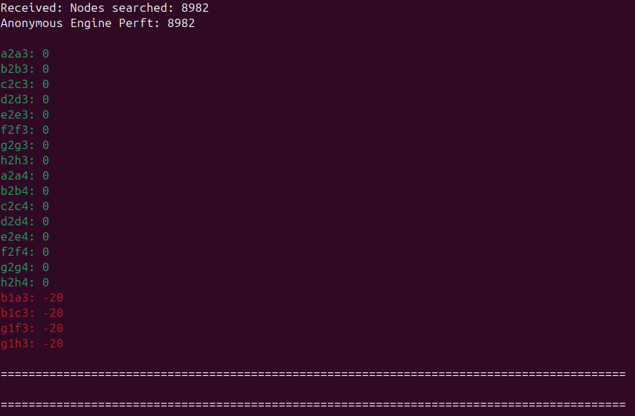

+++
title = 'Building a Chess Engine: From Concept to Code'
date = 2025-09-28T18:07:18-03:00
draft = false
tags = [
	"chess",
	 "programming",
]
image = "banner.png"
+++

## The Magic and the Machine

There is something mystical about the game of chess. It's ancient, with deceptively simple rules, yet each game unfolds with an almost endless array of possibilities. You can learn how the pieces move in minutes, but mastering the game can take months, even years.

The very first things we learn are the fundamental movements: the en passant, castling, pawn promotion. Without understanding these basic rules – the objective of capturing the opponent's king, the concepts of check and checkmate, and the foundations of openings, strategy, and tactics – we can't truly play.

But I always got thinking: **how do we make a computer play chess?** My ambition for this project is nothing less than to **beat the best available chess engine.** It's a daunting goal, given the formidable community behind top engines, but the journey of understanding and building a strong AI is a reward in itself.

---

## From Turing to AlphaZero: A Short History of Chess AI

The fundamental approaches to programming a computer to play chess stem from brilliant minds pondering how a machine could "think" about the game.

The father of computer science, Alan Turing, developed **Turochamp** in 1948. This was one of the earliest conceptual computer chess programs, capable of evaluating moves and considering opponent responses. Fascinatingly, he couldn't run it on the computers of his time, so he programmed it on paper and played it manually, meticulously following his own code step-by-step.

A year later, in 1949, Claude Shannon published his seminal paper, "[Programming a Computer for Playing Chess](https://archive.computerhistory.org/projects/chess/related_materials/text/2-0%20and%202-1.Programming_a_computer_for_playing_chess.shannon/2-0%20and%202-1.Programming_a_computer_for_playing_chess.shannon.062303002.pdf)". Here, he laid out crucial concepts for writing a good chess engine, many of which remain in use almost 60 years later. Shannon introduced important ideas such as algorithms for selecting moves, and methods to "prune" less promising game variations, focusing analysis only on the more fruitful ones. Even the concept of using a form of artificial intelligence to select moves based on the analytical position of the game was touched upon.

Since those initial ideas, the world of computer chess has seen incredible advancements, pushing machine capabilities far beyond human abilities. The first computer chess tournament took place in 1970, a time when human Grandmasters still reigned supreme. That changed dramatically in 1997 when **Deep Blue**, a supercomputer from IBM, famously defeated reigning world chess champion Garry Kasparov, marking the symbolic end of human dominance in the game. More recently, in 2019, Google's **AlphaZero** revolutionized the field by using neural networks and reinforcement learning to learn chess from scratch, without human input. Today (2025), the strongest freely available chess engine is **Stockfish**, an open-source program developed by a global community of chess and programming enthusiasts.

---

## The Three Pillars of a Chess Engine

From Shannon's foundational paper, we can distill a chess engine into three basic, interconnected parts:

- A **Board State**: This module holds all the information about the current piece positions, whose turn it is, castling rights, en passant targets, and other game settings.
    
- A **Move Generator**: Responsible for identifying and generating all possible valid moves for the current `Board State`.
    
- A **Move Evaluator**: Grades how good or bad a particular move is for the side making it, guiding the engine's decision-making process.
    


On the surface, it seems simple enough. If these are the core components, what makes one engine better than another? The answer primarily lies in two factors: **speed** – how many valid moves and positions the program can analyze per second – and the **quality of the move evaluator's "judgment"** for each position.

### Speaking the Language of Engines: The UCI Protocol

From the early computer chess championships in the 1970s, which often relied on telephone lines to connect disparate software, various standards for engine-to-engine or engine-to-GUI communication have emerged and evolved. The standard supported today is the **Universal Chess Interface (UCI)**. This protocol is the lingua franca that allows different chess engines and tools to communicate with each other. Implementing UCI means my engine can play against opponents on platforms like Lichess, integrate with tools for validating move generation, and connect to a Graphical User Interface (GUI) for an actual playable experience.

The basic functionality of the UCI protocol revolves around setting a board position for the chess engine and receiving the engine's best move in response. Beyond that, it handles memory allocation, thread management, time controls for each side, and commands to stop the search. The chess engine must constantly listen for UCI commands, as the interface can halt its search at any time.

The protocol can be break down in easy steps:
1. GUI sends a "uci" command, meaning that will use the UCI protocol to talk with the engine
2. Engine replies with "uciok"
3. GUI sends the board position
4. GUI pass the time constrains in the "go" command
5. Engine replies with the best move.

This behavior can be concisely represented by a state machine:


---

## Inside the Machine's Mind: FEN and Board Representation

To function, an engine needs ways to represent the chess board and its pieces efficiently.

### Forsyth-Edwards Notation (FEN)

The current chess board position is most commonly represented using the **Forsyth-Edwards Notation (FEN)**. A GUI can send the `ucinewgame` command to instruct the engine to start from the standard initial position, or it can provide a FEN string to set up any arbitrary position. FEN is a compact, easy-to-read string that encapsulates all the essential information about a 64-square board.

Here's the string for the starting position:
```
rnbqkbnr/pppppppp/8/8/8/8/PPPPPPPP/RNBQKBNR w KQkq - 0 1
```

Each '/' separates the ranks, the letters say which piece is in that square:
- K = King
- Q = Queen
- R = Rook
- B = Bishop
- N = Knight
- P = Pawn

The uppercase letter indicates that this is a white piece and lowercase letter indicates that is a black piece. Numbers tell us how many empty squares are there in sequence. 

Beside the piece positions and empty squares, it also says who is to move, if white and black has castling rights, which square en passant is possible, and how many moves were made. If there is a en passant square, there is the square notation in the FEN, otherwise the dash '-' is used.

A FEN string can be broke down in this way:

```
FEN: <position> <side to move> <castling rights> <en passant square> <half move number> <full move number>
```

The engine has to be able to understand the FEN string when passed to it, so that it can populate the internal board squares and game state. An important thing to notice here is that the string begins with the last square `(h8)` at the first position of the string, meaning that when we parse the string we begin setting our board at the last square first, this has to be take into consideration when filling our board, otherwise we can end up with our board mirrored.

### Choosing a Board Structure: Mailbox vs 8x8

My first thought for board representation was a simple 8x8 grid or a 64-element array, directly mirroring a real chess board:

```
  A B C D E F G H
8 ♖ ♘ ♗ ♕ ♔ ♗ ♘ ♖ 8
7 ♙ ♙ ♙ ♙ ♙ ♙ ♙ ♙ 7
6 . . . . . . . . 6
5 . . . . . . . . 5
4 . . . . . . . . 4
3 . . . . . . . . 3
2 ♟ ♟ ♟ ♟ ♟ ♟ ♟ ♟ 2
1 ♜ ♞ ♝ ♛ ♚ ♝ ♞ ♜ 1
  A B C D E F G H
```

The primary downside of this approach, especially when generating moves, is the constant need to check if a potential move falls within the board boundaries. This can introduce performance overhead.

To mitigate this, I opted for a slightly larger board representation known as a **12x10 "Mailbox"** with "sentinel squares". These extra squares around the perimeter act as blockers, eliminating the need for explicit boundary checks during move generation.

```
    Z A B C D E F G H I
8+2 . . . . . . . . . . 8+2
8+1 . . . . . . . . . . 8+1
 8  . ♖ ♘ ♗ ♕ ♔ ♗ ♘ ♖ .  8
 7  . ♙ ♙ ♙ ♙ ♙ ♙ ♙ ♙ .  7
 6  . . . . . . . . . .  6
 5  . . . . . . . . . .  5
 4  . . . . . . . . . .  4
 3  . . . . . . . . . .  3
 2  . ♟ ♟ ♟ ♟ ♟ ♟ ♟ ♟ .  2
 1  . ♜ ♞ ♝ ♛ ♚ ♝ ♞ ♜ .  1
 0  . . . . . . . . . .  0
-1  . . . . . . . . . . -1
    Z A B C D E F G H I
```

With this 12x10 setup, a knight on 'h8' (the top-right of the inner 8x8 board) might generate valid moves like `{Nf7, Ng6}` alongside "invalid" moves that hit sentinel squares, like `{Ng10, Ni10, Ni6, Nf9, Nz9, Nz7}`. The key is that we generate _all_ moves (even off-board ones) and then filter for validity _after_, simplifying the initial generation logic. This trade-off often leads to faster move generation. Careful mapping between the 8x8 and 12x10 indices is crucial (e.g., square '0' on 8x8 might be '21' on 12x10). Ideally, the board representation should be flexible enough to experiment with different dimensions for performance testing.

### Piece Lists and Vector Attacks

When generating moves, directly iterating over every square of the board to find pieces and then calculating their moves is inefficient, as most squares are often empty. To optimize this, we keep track of piece positions more directly. While many modern engines use `Bitboards` for extreme performance, I wanted to understand the practical differences, so I started with **Piece Lists**.

Instead of two broad lists (white pieces and black pieces), which still require iteration to find specific piece types, a more efficient approach is to segregate each piece type into its own list. For example:

``` Rust
white_king_list    : [u8:1];   // Always 1 king
white_queen_list   : [u8:9];   // Max 9 queens (1 original + 8 promoted)
white_rook_list    : [u8:10];  // Max 10 rooks
// ... and so on for bishops, knights, and pawns for both colors.
```

This way, when generating moves for, say, a white queen, I can directly access a list of all white queen positions on the board without a global search. For each piece's position, I then calculate its possible moves using **Vector Attacks**.

"Vector attacks" are precomputed direction offsets (like `+1`, `-1`, `+10`, etc.) that allow the move generator to iterate through squares in a given direction without expensive coordinate math. This is particularly effective for sliding pieces (queen, bishop, rook) but also describes the movements of knights and kings.

Consider the 12x10 board structure, where moving right/left is `+/- 1` index, and moving up/down involves jumping by the width of the board (in this case, `+/- 10`).

``` C
   NW   N   NE
   +9  +10  +11

W  -1   0   +1  E

   -11 -10  -9
   SW   S   SE
```

This becomes clearer when we implement the logic for the pieces:

``` C
// 12x10 board size

// Rook
directions = [+1, -1, +10, -10]  // E, W, N, S
for dir in directions:
    pos = rook_pos + dir
    while board[pos] is empty:
        add pos to move list
        pos += dir
    if board[pos] has opponent piece:
        add pos to move list

// Bishop
directions = [+9, -9, +11, -11]
for dir in directions:
	pos = bishop_pos + dir
    while board[pos] is empty:
        add pos to move list
        pos += dir
    if board[pos] has opponent piece:
        add pos to move list

// Queen
directions = [+1, -1, +9, -9, +10, -10, +11, -11]
for dir in directions:
	pos = queen_pos + dir
    while board[pos] is empty:
        add pos to move list
        pos += dir
    if board[pos] has opponent piece:
        add pos to move list

// King
directions = [+1, -1, +9, -9, +10, -10, +11, -11]
for dir in directions:
	pos = king_pos + dir
    if board[pos] is empty:
        add pos to move list
    if board[pos] has opponent piece:
        add pos to move list
```

Pawns present a greater challenge due to their unique rules: moving forward (one or two squares on the first move) if unobstructed, capturing diagonally, en passant, and promotion. These require more specific logic to handle their varied movement patterns and conditional captures.

``` C
// Example: Pawn forward movement (simplified, no en passant/promotion)
pos = pawn_pos + 10; // Assuming +10 for white pawn moving "up" on 12x10 board
                      // Direction is color-dependent (+ for White, - for Black)
if (board[pos] == EMPTY)
    add pos to move list

if (on_rank_2(pawn_pos)) { // Check if pawn is on its starting rank
    pos_2 = pawn_pos + 20; // Two squares forward
    if (board[pos] == EMPTY && board[pos_2] == EMPTY)
        add pos_2 to move list
}

cap_left = pawn_pos + 9;  // Diagonal capture
if (is_enemy(board[cap_left]))
    add_move(pawn_pos, cap_left);
cap_right = pawn_pos + 11; // Diagonal capture
if (is_enemy(board[cap_right]))
    add_move(pawn_pos, cap_right);
```

---

## Code Organization: From State to Legal Moves 

Because the chess engine involves layers of complex logic, maintaining a clear **separation of concerns** is essential. Each part of the code should have a well-defined responsibility:

- **UCI Interface:** Handle communication with the GUI — receive UCI commands, send responses, and manage move counters.  
- **Game State Module:** Maintain the positions of all pieces, castling rights, en passant information, and generate legal or pseudo-legal moves.  
- **Search Module:** Explore move trees, evaluate positions, and remember previously visited states through techniques like transposition tables.

Without this separation, the codebase can quickly devolve into a tangled mess — where every small modification or optimization risks introducing new bugs.  
A clean architecture not only makes development easier but also enables **profiling, optimization, and testing** to happen in isolation, keeping the engine both fast and maintainable.

### Separation of Concerns

My approach divides the engine into several core modules: one for receiving and responding to UCI commands, another for managing the game state (move count, castling rights, etc.), and a crucial module for board representation and move generation. This modularity allows us to swap out implementations (e.g., trying a different move generation algorithm) without rewriting unrelated parts.

This structure is encapsulated in the following class diagram:


### The Move Generator Flow

Combining the mailbox board, piece lists, and vector attacks, the move generator is implemented in two main parts:

1. **Pseudo-Legal Moves:** This phase generates all possible moves for all pieces, regardless of whether they leave the king in check. This is often the fastest part.
    
2. **Legality Filter:** For each pseudo-legal move, the engine temporarily makes the move, checks if the king is in check after the move, and then "unmakes" it. Only moves that do _not_ leave the king in check are considered truly legal.    

This process can be visualized as:


That works, but how to be sure that all moves are accounted for and if there's not a bug that is generating wrong moves?

---

## The Search for Truth: Debugging with Perft

After implementing the initial move generator, the critical question arises: how can I be sure that all moves are accounted for, and that no invalid moves are being generated? This is where **Perft (Performance Test)** comes in, a standard tool in chess engine development.

### The Perft Test

Perft tests recursively generate and count all legal moves from a given position up to a certain depth. By comparing these counts against known reference values, we can pinpoint bugs in the move generation logic. I wrote a `perft` function based on examples from the Chess Programming Wiki:

``` rust
pub fn perft(&mut self, depth: u64) -> u64 {
    if depth == 0 {
        return 1; // Base case: one node (the position itself)
    }

    let color = self.side_to_move;
    let moves = self.board.generate_moves(color); // This includes filtering for legality

    let mut nodes = 0;

    for mv in moves {
        self.board.make_move(&mv);
        self.side_to_move = self.side_to_move.opposite();
        nodes += self.perft(depth - 1); // Recurse for the next depth
        self.side_to_move = self.side_to_move.opposite();
        self.board.unmake_move(&mv); // Crucial: unmake move to restore board state
    }

    nodes
}
```
And checking with the reference values I found discrepant results:

| Depth | My engine perft | Reference Value |
| ----- | --------------- | --------------- |
| 0     | 1               | 1               |
| 1     | 20              | 20              |
| 2     | 400             | 400             |
| 3     | **8,982**       | 8,902           |
| 4     | **200,915**     | 197,281         |
| 5     | **5,028,487**   | 4,865,609       |

Not great, my engine is generating invalid moves at depth 3 and beyond, but where is the bug?

### Using the Tool: PerftDifferenceTool

To attack the problem, I implemented a non standard UCI command called `perft`, and leveraged a tool called **[PerftDifferenceTool](https://github.com/AlekGayko/PerftDifferenceTool)**. This tool compares my engine's perft output against a known good engine (like Stockfish), highlighting exactly which move sequences lead to discrepancies. 


First, I modified my `perft_debug` function to output node counts per move, in a format the tool could understand. With the help of DeepSeek I got to this function:

``` rust
pub fn perft_debug(&mut self, depth: u64, print: bool) -> u64 {
	if depth == 0 {
		return 1;
	}
	
	let color = self.side_to_move;
	let moves = self.board.generate_moves(color);
	
	if print {
		println!("Depth {}: {} moves", depth, moves.len());
	}
	
	let mut total_nodes = 0;
	
	for mv in moves {
		self.board.make_move(&mv);
		self.side_to_move = self.side_to_move.opposite();
		
		let nodes = if depth == 1 {
			1 // Base case for counting at depth 1
		} else {
			self.perft_debug(depth - 1, false) // Recurse without printing
		};
		
		if print {
			println!("{}: {}", self.board.move_to_uci(&mv), nodes); // Print move and its node count
		}
		
		total_nodes += nodes;
		
		self.side_to_move = self.side_to_move.opposite();
		self.board.unmake_move(&mv);
	}
	
	if print {
		println!("Total: {}", total_nodes);
	}
	
	total_nodes
}
```
 
 The idea of the code is neat, for each move, we count how many moves our engine generated from that point on. Running this provided an output like:
 
``` Bash
$ cargo run
ucinewgame
go perft 3
Depth 3: 20 moves
b1c3: 460
b1a3: 420
g1h3: 420
g1f3: 460
a2a3: 380
a2a4: 420
b2b3: 420
b2b4: 421
c2c3: 420
c2c4: 441
d2d3: 539
d2d4: 560
e2e3: 599
e2e4: 600
f2f3: 380
f2f4: 401
g2g3: 420
g2g4: 421
h2h3: 380
h2h4: 420
Total: 8982
bestmove b1c3
```

Now plugin in the tool... it hangs, that's because the code is expecting the same output format as Stockfish:

``` python
# engine.py
if first == "Nodes searched":
            return first, int(second)
```

So changing my output the tool recognize the conclusion of my engine search:

The problem appears after the knight movement, thankfully the tool provide the move sequence to narrow down the problem:
```bash
==============================================================================

FEN: rnbqkbnr/1ppppppp/p7/8/8/N7/PPPPPPPP/R1BQKBNR w KQkq - 0 2
Moves: b1a3 a7a6 b2b3

==============================================================================
```
This specific position


My pawn move logic was not checking if there was a piece directly in front of the pawn before allowing it to move two squares, causing it to "jump" over the knight on `a3`

### Unit Testing

Testing with `PerftDifferenceTool` was invaluable for finding specific bugs, but I was still getting wrong results for perft tests in other more complex positions, and I wasn't sure if my fixes weren't breaking something else, that was when I decided to write some unit tests, and thankfully I did so. With a few basic inputs I got a lot of wrong logic in my code, mostly on castling, pawns, and edge cases, here's a simple test to check if my engine generates the kingside castling move correctly:

``` rust
fn test_white_kingside_castling() {
	let mut game = GameState::default();
	
	// Set a FEN position where white can kingside castle
	game.set_fen_position("r3k2r/pppppppp/8/8/8/8/PPPPPPPP/R3K2R w KQkq - 0 1");
	
	let moves = game.generate_moves(Color::White);

	// Assert that the kingside castling move ("e1g1") is present
	assert!(
	moves.contains(&"e1g1".to_string()),	
	"Kingside castling move not found. Moves: {:?}",
	moves
	);

	// Also assert that other moves are present (basic check for non-empty moves list)
	assert!(
	moves.len() >= 1,
	"Expected at least 1 move, got {}",
	moves.len()
	);
}
```

Very simple, and very helpful.

### Profiling the Bottleneck

With a working (and tested!) move generator, a basic material-count evaluation function, and a preliminary search function, I wanted to understand where my engine was spending most of its time. Using a profiling tool like `flamegraph` revealed the performance hotspots:


It became immediately clear from the flamegraph that the most significant bottleneck in my engine is the legal move generator, specifically the process of making a move and checking if the king is in check. This "king safety check" is executed for _every_ pseudo-legal move, consuming a substantial portion of the engine's processing time.

---

## Conclusion and The Road Ahead

The development journey so far has been incredibly illuminating. I've laid essential groundwork by understanding the history of computer chess, implementing the essential **UCI protocol**, the **FEN parser**, the **12x10 mailbox board**, and **piece lists with vector attacks**. Crucially, the move generator has been rigorously tested and validated using **Perft tests** and comprehensive **unit tests**.

Profiling with flamegraphs has revealed a clear directive for optimization: the **legal move generator** remains the dominant performance bottleneck. The requirement to make and unmake every pseudo-legal move to verify **king safety** consumes a significant share of total computation time.

The next step is to **evaluate the engine’s Elo rating**, allowing me to measure whether future modifications actually translate into improved playing strength. This process will be automated to prevent distractions and maintain focus on core development. Once a consistent Elo testing framework is in place, the focus will shift toward generating **inherently legal, king-safety-aware moves**, removing the need for the costly trial-and-error approach.

Beyond this crucial speed upgrade, the next set of challenges will be to implement the advanced features required to evolve the engine from a working prototype into a competitive engine:

- **Benchmarking Code:** Implementing standardized tests to measure performance metrics (like nodes per second) and ensure future optimizations actually lead to speed gains.
    
- **Improve Evaluation Function:** Enhancing the basic material-count evaluator with positional, strategic, and dynamic factors to improve the engine's "judgment."
    
- **Transposition Tables:** Implementing a hash table to store and retrieve previously analyzed board positions, drastically reducing redundant searches in the search tree.

The foundation is solid, and the roadmap for significant strength gains is clear. The challenge continues!

---

## Resources

- [Programming a Computer for Playing Chess](https://archive.computerhistory.org/projects/chess/related_materials/text/2-0%20and%202-1.Programming_a_computer_for_playing_chess.shannon/2-0%20and%202-1.Programming_a_computer_for_playing_chess.shannon.062303002.pdf)
- [Chess Programming Wiki](www.chessprogramming.org)
- [UCI Specification](https://gist.github.com/DOBRO/2592c6dad754ba67e6dcaec8c90165bf)
- [FEN Viwer](https://www.redhotpawn.com/chess/chess-fen-viewer.php)
- [Cute Chess](https://cutechess.com/)
- [Perft Difference Tool](https://github.com/AlekGayko/PerftDifferenceTool/tree/main)
