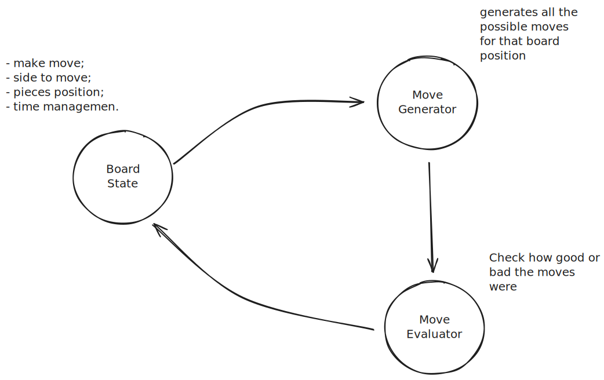
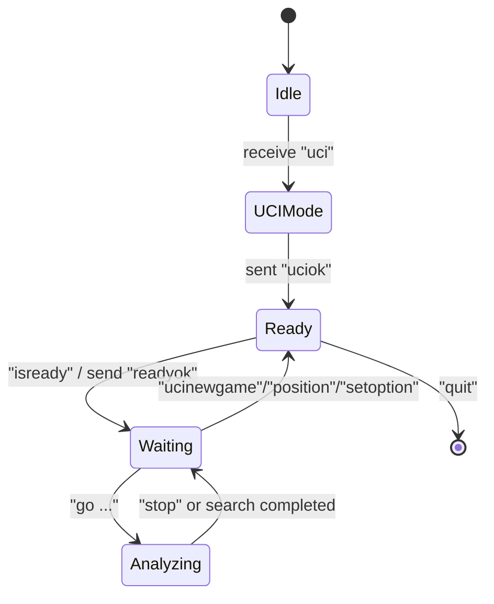
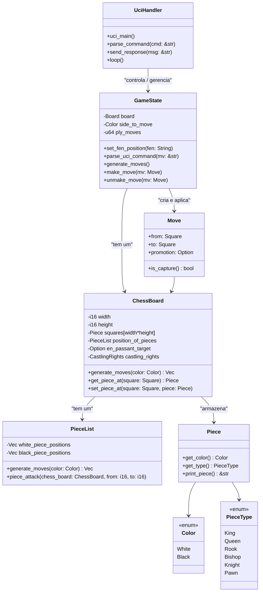
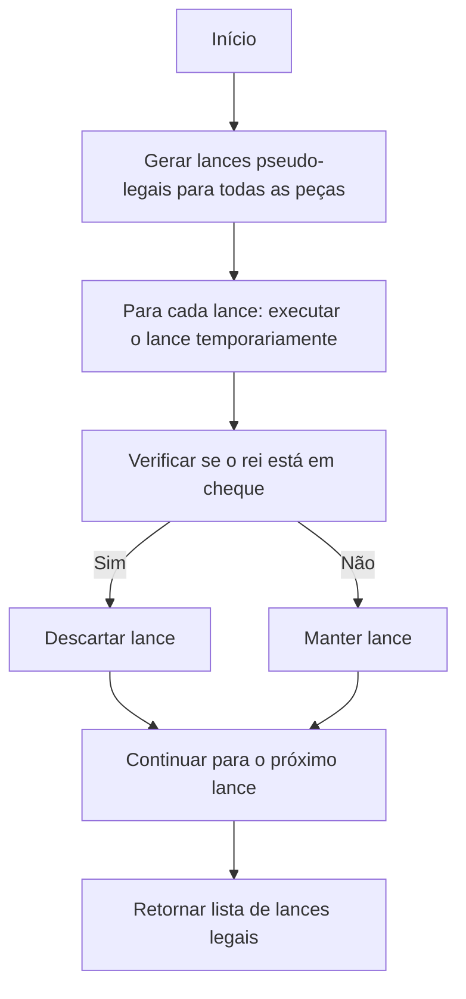
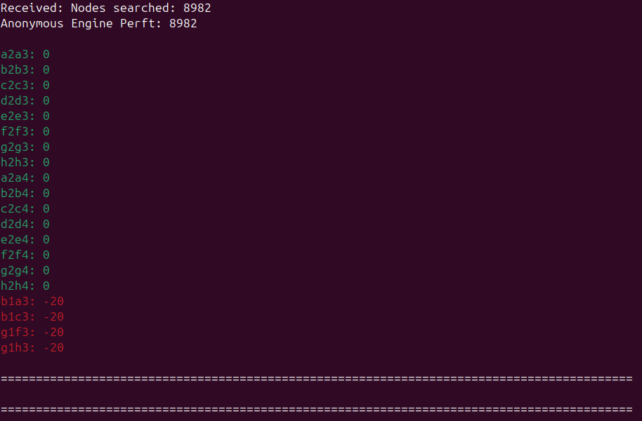
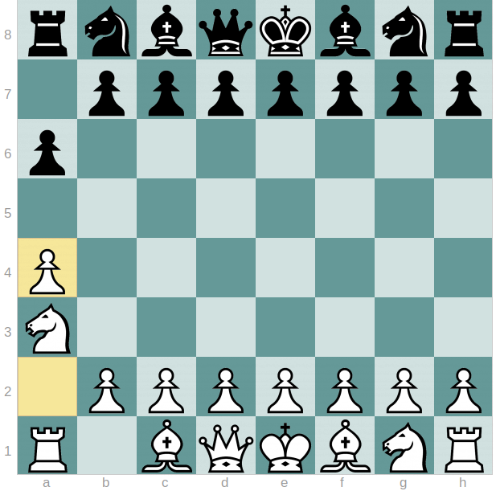
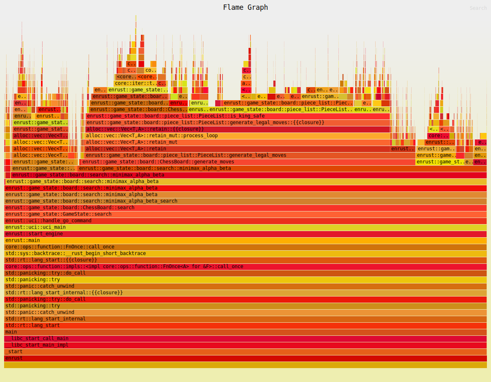

+++
title = 'Construindo um Programa de Xadrez: Da Concepção ao Código'
date = 2025-09-28T18:07:18-03:00
draft = false
tags = [
	"chess",
	 "programming",
]
image="banner.png"
+++

## Magia e Máquina

Há algo místico no jogo de xadrez. É antigo, com regras enganosamente simples, mas cada partida se desenrola com uma variedade quase infinita de possibilidades. Você pode aprender como as peças se movem em minutos, mas dominar o jogo pode levar meses, até anos.

As primeiras coisas que aprendemos são os movimentos fundamentais: o _en passant_, o roque, a promoção do peão. Sem entender estas regras básicas — o objetivo de capturar o rei do oponente, os conceitos de cheque e xeque-mate, e os fundamentos de aberturas, estratégia e tática — não podemos, de fato, jogar.

Mas eu sempre me peguei pensando: **como fazemos um computador jogar xadrez?** Minha ambição para este projeto é nada menos que **vencer o melhor engine de xadrez disponível.** É um objetivo assustador, dada a comunidade formidável por trás dos melhores engines, mas a jornada de entender e construir uma IA forte é uma recompensa em si.

---

## De Turing a AlphaZero: Uma Breve História da IA do Xadrez

As abordagens fundamentais para programar um computador para jogar xadrez vieram de mentes brilhantes que ponderaram sobre como uma máquina poderia "pensar" o jogo.

O pai da ciência da computação, Alan Turing, desenvolveu o **Turochamp** em 1948. Este foi um dos primeiros programas conceituais de xadrez para computador, capaz de avaliar lances e considerar as respostas do oponente. De forma fascinante, ele não podia executá-lo nos computadores de sua época, então ele o programou no papel e jogava manualmente, seguindo meticulosamente seu próprio código passo a passo.

Um ano depois, em 1949, Claude Shannon publicou seu artigo seminal, "Programando um Computador para Jogar Xadrez" ([_Programming a Computer for Playing Chess_](https://archive.computerhistory.org/projects/chess/related_materials/text/2-0%20and%202-1.Programming_a_computer_for_playing_chess.shannon/2-0%20and%202-1.Programming_a_computer_for_playing_chess.shannon.062303002.pdf)). Nele, ele estabeleceu conceitos cruciais para escrever um bom *engine* de xadrez, muitos dos quais permanecem em uso quase 60 anos depois. Shannon introduziu ideias importantes como algoritmos para seleção de lances e métodos para "podar" variações de jogo menos promissoras, focando a análise apenas nas mais frutíferas. Até mesmo o conceito de usar uma forma de inteligência artificial para selecionar lances com base na posição analítica do jogo foi mencionada.

Desde essas ideias iniciais, o mundo do xadrez por computador viu avanços incríveis, empurrando as capacidades da máquina muito além das habilidades humanas. O primeiro torneio de xadrez para computadores ocorreu em 1970, uma época em que os Grandes Mestres humanos ainda reinavam. Isso mudou drasticamente em 1997, quando o **Deep Blue**, um supercomputador da IBM, derrotou o então campeão mundial Garry Kasparov, marcando o fim simbólico do domínio humano no jogo. Mais recentemente, em 2019, o **AlphaZero** do Google revolucionou o campo ao usar redes neurais e aprendizado por reforço para aprender xadrez do zero, sem intervenção humana. Hoje (2025), o engine de xadrez mais forte e livremente disponível é o **Stockfish**, um programa de código aberto desenvolvido por uma comunidade global de entusiastas de xadrez e programação.

---

## Os Três Pilares de um Motor de Xadrez

A partir do artigo fundamental de Shannon, podemos quebrar um programa de xadrez em três partes básicas e interconectadas:

- Um **Estado do Tabuleiro** (_Board State_): Este módulo contém todas as informações sobre as posições atuais das peças, de quem é a vez de jogar, direitos de roque, alvos _en passant_ e outras configurações do jogo.
    
- Um **Gerador de Jogadas** (_Move Generator_): Responsável por identificar e gerar todos os possíveis lances válidos para a posição atual do tabuleiro.
    
- Um **Avaliador de Jogadas** (_Move Evaluator_): Classifica quão bom ou ruim é um determinado movimento para o lado que o realiza, orientando o processo de tomada de decisão do programa.
    


Na superfície, parece simples. Se estes são os componentes centrais, o que torna um programa de xadrez melhor do que outro? A resposta reside principalmente em dois fatores: **velocidade** – quantas jogadas e posições válidas o programa pode analisar por segundo – e a **qualidade do "julgamento" do avaliador das jogadas** para cada posição.

### Falando a Linguagem dos Motores: O Protocolo UCI

Desde os primeiros campeonatos de xadrez por computador na década de 1970, que frequentemente dependiam de linhas telefônicas para conectar softwares díspares, vários padrões para comunicação engine-para-engine ou engine-para-GUI surgiram e evoluíram. O padrão suportado hoje é a **Interface Universal de Xadrez** (_Universal Chess Interface_ ou **UCI**). Este protocolo é a _lingua franca_ que permite que diferentes engines e ferramentas de xadrez se comuniquem. Implementar o UCI significa que meu *engine* pode jogar contra oponentes em plataformas como o Lichess, integrar-se com ferramentas para validar a geração de lances e conectar-se a uma Interface Gráfica do Usuário (GUI) para uma experiência jogável.

A funcionalidade básica do protocolo UCI gira em torno de definir uma posição de tabuleiro para o *engine* de xadrez e receber o melhor lance do *engine* como resposta. Além disso, ele lida com alocação de memória, gerenciamento de _threads_, controle de tempo para cada lado e comandos para parar a busca. O *engine* de xadrez deve ouvir constantemente os comandos UCI, pois a interface pode interromper sua busca a qualquer momento.

O protocolo pode ser dividido em etapas simples:

1. A GUI envia o comando "uci", indicando que usará o protocolo UCI para se comunicar com o engine.
2. O Engine responde com "uciok".    
3. A GUI envia a posição do tabuleiro.    
4. A GUI passa as restrições de tempo no comando "go".    
5. O Engine responde com o melhor lance.    

Este comportamento pode ser representado de forma concisa por uma máquina de estados:



---

## Dentro da Mente da Máquina: FEN e Representação do Tabuleiro

Para funcionar, um *engine* precisa de maneiras de representar o tabuleiro de xadrez e suas peças de forma eficiente.

### Notação Forsyth-Edwards (FEN)

A posição atual do tabuleiro de xadrez é mais comumente representada usando a **Notação Forsyth-Edwards (FEN)**. Uma GUI pode enviar o comando `ucinewgame` para instruir o engine a começar da posição inicial padrão, ou pode fornecer uma _string_ FEN para configurar qualquer posição arbitrária. FEN é uma _string_ compacta e fácil de ler que encapsula todas as informações essenciais sobre um tabuleiro de 64 casas.

Aqui está a _string_ para a posição inicial: 
```
rnbqkbnr/pppppppp/8/8/8/8/PPPPPPPP/RNBQKBNR w KQkq - 0 1
```

Cada '/' separa as fileiras, as letras indicam qual peça está naquela casa:
- K = Rei
- Q = Rainha
- R = Torre
- B = Bispo
- N = Cavalo    
- P = Peão    

A letra maiúscula indica que é uma peça branca e a minúscula indica que é uma peça preta. Os números nos dizem quantas casas vazias estão em sequência.

Além das posições das peças e das casas vazias, também diz de quem é a vez de mover, se branco e preto têm direitos de roque, qual casa é possível para o _en passant_ e quantos lances foram feitos. Se houver uma casa _en passant_, há a notação da casa no FEN, caso contrário, o traço '-' é usado.

Uma _string_ FEN pode ser detalhada desta forma:

```
FEN: <posição> <lado a mover> <direitos de roque> <casa en passant> <número de meio-lance> <número de lance completo>
```

O engine deve ser capaz de entender a _string_ FEN para que possa preencher as casas internas do tabuleiro e o estado do jogo. Uma coisa importante a notar é que a _string_ começa com a última casa (`h8`) na primeira posição da _string_, o que significa que ao analisar a _string_, começamos a configurar nosso tabuleiro pela última casa primeiro. Isso deve ser levado em consideração ao preencher nosso tabuleiro, caso contrário, podemos acabar com nosso tabuleiro espelhado.

### Escolhendo uma Estrutura de Tabuleiro: Mailbox vs 8x8

Minha primeira ideia para a representação do tabuleiro foi usar uma grade simples de 8 por 8 ou um array de 64 elementos, espelhando diretamente um tabuleiro de xadrez real:

```
  A B C D E F G H
8 ♖ ♘ ♗ ♕ ♔ ♗ ♘ ♖ 8
7 ♙ ♙ ♙ ♙ ♙ ♙ ♙ ♙ 7
6 . . . . . . . . 6
5 . . . . . . . . 5
4 . . . . . . . . 4
3 . . . . . . . . 3
2 ♟ ♟ ♟ ♟ ♟ ♟ ♟ ♟ 2
1 ♜ ♞ ♝ ♛ ♚ ♝ ♞ ♜ 1
  A B C D E F G H
```

A principal desvantagem desta abordagem, especialmente ao gerar lances, é a necessidade constante de verificar se um potencial lance cai dentro dos limites do tabuleiro. Isso pode deixar o programa lento.

Para mitigar isso, escolhi uma representação de tabuleiro ligeiramente maior conhecida como **"Mailbox" 12x10** com "casas sentinela" (_sentinel squares_). Estas casas extras ao redor do perímetro atuam como bloqueadores, eliminando a necessidade de verificações explícitas de limite durante a geração de lances.

```
    Z A B C D E F G H I
8+2 . . . . . . . . . . 8+2
8+1 . . . . . . . . . . 8+1
 8  . ♖ ♘ ♗ ♕ ♔ ♗ ♘ ♖ .  8
 7  . ♙ ♙ ♙ ♙ ♙ ♙ ♙ ♙ .  7
 6  . . . . . . . . . .  6
 5  . . . . . . . . . .  5
 4  . . . . . . . . . .  4
 3  . . . . . . . . . .  3
 2  . ♟ ♟ ♟ ♟ ♟ ♟ ♟ ♟ .  2
 1  . ♜ ♞ ♝ ♛ ♚ ♝ ♞ ♜ .  1
 0  . . . . . . . . . .  0
-1  . . . . . . . . . . -1
    Z A B C D E F G H I
```

Com esta configuração 12x10, um cavalo em 'h8' (o canto superior direito do tabuleiro interno 8x8) pode gerar movimentos válidos como `{Nf7, Ng6}` juntamente com lances "inválidos" que atingem casas sentinela, como `{Ng10, Ni10, Ni6, Nf9, Nz9, Nz7}`. O ponto chave é que geramos _todos_ os lances (mesmo os fora do tabuleiro) e  filtramos a validade _depois_, simplificando a lógica de geração inicial. Essa troca muitas vezes leva a uma geração de jogadas mais rápida. O mapeamento cuidadoso entre os índices 8x8 e 12x10 é crucial (por exemplo, a casa '0' no 8x8 pode ser '21' no 12x10). Idealmente, a representação do tabuleiro deve ser flexível o suficiente para experimentar diferentes dimensões visando testes de desempenho.

### Listas de Peças e Ataques Vetoriais

Ao gerar lances, iterar diretamente sobre cada casa do tabuleiro para encontrar peças e depois calcular seus lances é ineficiente, pois a maioria das casas costuma estar vazia. Para otimizar isso, rastreamos as posições das peças de forma mais direta. Embora muitos *engines* modernos usem _Bitboards_ para desempenho extremo, eu queria entender as diferenças práticas, então comecei com **Listas de Peças** (_Piece Lists_).

Em vez de duas listas amplas (peças brancas e peças pretas), que ainda exigem iteração para encontrar tipos de peças específicas, uma abordagem mais eficiente é segregar cada tipo de peça em sua própria lista. Por exemplo:

``` Rust
white_king_list    : [u8:1];   // Sempre 1 rei
white_queen_list   : [u8:9];   // Máximo de 9 rainhas (1 original + 8 promovidas)
white_rook_list    : [u8:10];  // Máximo de 10 torres
// ... e assim por diante para bispos, cavalos e peões para ambas as cores.
```

Desta forma, ao gerar lances para, digamos, uma rainha branca, posso acessar diretamente uma lista de todas as posições das rainhas brancas no tabuleiro sem uma busca global. Para a posição de cada peça, calculo então seus possíveis lances usando **Ataques Vetoriais** (_Vector Attacks_).

"Ataques vetoriais" são _offsets_ de direção pré-calculados (como `+1`, `-1`, `+10`, etc.) que permitem que o gerador de lances itere pelas casas em uma determinada direção sem cálculos matemáticos de coordenadas custosos. Isso é particularmente eficaz para peças que deslizam (rainha, bispo, torre), mas também descreve os movimentos de cavalos e reis.

Considere a estrutura do tabuleiro 12x10, onde mover para a direita/esquerda é um índice `+/- 1`, e mover para cima/baixo envolve pular pela largura do tabuleiro (neste caso, `+/- 10`).

``` C
    NO   N   NE
    +9  +10  +11

O   -1   0   +1  L

   -11 -10  -9
    SO   S   SE
```

Isso fica mais claro quando implementamos a lógica para as peças:

``` C
// Exemplo: Movimento de Torre em um tabuleiro 12x10

// Torre
directions = [+1, -1, +10, -10]  // L, O, N, S
for dir in directions:
    pos = rook_pos + dir
    while board[pos] is empty:
        add pos to move list
        pos += dir
    if board[pos] has opponent piece:
        add pos to move list

// Bispo
directions = [+9, -9, +11, -11] // NO, SE, NE, SO
for dir in directions:
    pos = bishop_pos + dir
    while board[pos] is empty:
        add pos to move list
        pos += dir
    if board[pos] has opponent piece:
        add pos to move list

// Rainha: combinação das direções da Torre + Bispo
directions = [+1, -1, +9, -9, +10, -10, +11, -11]
for dir in directions:
    pos = queen_pos + dir
    while board[pos] is empty:
        add pos to move list
        pos += dir
    if board[pos] has opponent piece:
        add pos to move list

// Rei: mesmas direções da rainha, mas apenas um passo
directions = [+1, -1, +9, -9, +10, -10, +11, -11]
for dir in directions:
    pos = king_pos + dir
    if board[pos] is empty:
        add pos to move list
    if board[pos] has opponent piece:
        add pos to move list
```

Os peões apresentam um desafio maior devido às suas regras únicas: mover para frente (uma ou duas casas no primeiro lance) se não estiverem obstruídos, capturar nas diagonais, _en passant_ e promoção. Estes exigem lógica mais específica para lidar com seus variados padrões de movimento e capturas condicionais.

``` C
// Exemplo: Movimento de Peão para frente (simplificado, sem en passant/promoção)
pos = pawn_pos + 10; // Assumindo +10 para peão branco movendo-se "para cima" no tabuleiro 12x10
                      // A direção depende da cor (+ para Branco, - para Preto)
if (board[pos] == EMPTY)
    add pos to move list

if (on_rank_2(pawn_pos)) { // Verifica se o peão está em sua fileira inicial
    pos_2 = pawn_pos + 20; // Duas casas para frente
    if (board[pos] == EMPTY && board[pos_2] == EMPTY)
        add pos_2 to move list
}

cap_left = pawn_pos + 9;  // Captura diagonal
if (is_enemy(board[cap_left]))
    add_move(pawn_pos, cap_left);
cap_right = pawn_pos + 11; // Captura diagonal
if (is_enemy(board[cap_right]))
    add_move(pawn_pos, cap_right);
```

---

## Organização do Código: Do Estado aos Lances Legais

Como o engine de xadrez envolve camadas de lógica complexa, manter uma clara **separação de responsabilidades** (_separation of concerns_) é essencial. Cada parte do código deve ter uma responsabilidade bem definida:

- **Interface UCI:** Lidar com a comunicação com a GUI — receber comandos UCI, enviar respostas e gerenciar o contador de jogadas feitas.
    
- **Módulo de Estado do Jogo:** Manter as posições de todas as peças, direitos de roque, informações _en passant_ e gerar movimentos legais ou pseudo-legais.
    
- **Módulo de Busca:** Explorar árvores de jogadas, avaliar posições e lembrar estados visitados anteriormente por meio de técnicas como tabelas de transposição.

Sem esta separação, a base de código pode rapidamente acabar em um emaranhado de coisas — onde cada pequena modificação ou otimização corre o risco de introduzir novos _bugs_. Uma arquitetura limpa não só facilita o desenvolvimento, mas também permite que **otimização, _profiling_ e testes** ocorram isoladamente, mantendo a aplicação rápida e de fácil manutenção.

### Separação de Responsabilidades

Minha abordagem divide o programa em vários módulos principais: um para receber e responder aos comandos UCI, outro para gerenciar o estado do jogo (contagem de lances, direitos de roque, etc.) e um módulo para representação do tabuleiro e geração de jogadas. Essa modularidade nos permite trocar implementações (por exemplo, testar um algoritmo de geração de jogadas diferente) sem reescrever partes não relacionadas.

Esta estrutura está encapsulada no seguinte diagrama de classes:



### O Fluxo do Gerador de Movimentos

Combinando o tabuleiro _mailbox_, as listas de peças e os ataques vetoriais, o gerador de movimentos é implementado em duas partes principais:

1. **Lances Pseudo-Legais:** Esta fase gera todos os lances possíveis para todas as peças, independentemente de deixarem o rei em cheque. Esta é geralmente a parte mais rápida.
    
2. **Filtro de Legalidade:** Para cada lance pseudo-legal, o *engine* executa temporariamente o lance, verifica se o rei está em cheque após o lance e, em seguida, "desfaz" o lance. Apenas os lances que _não_ deixam o rei em cheque são considerados verdadeiramente legais.

Este processo pode ser visualizado assim:



Isso funciona, mas como ter certeza de que todos os lances são contabilizados e se não há um _bug_ fazendo jogadas erradas?

---

## Buscando a Verdade: Debugando com Perft

Após implementar o gerador de lances inicial, surge a pergunta: como posso ter certeza de que todos os movimentos são gerados e que nenhum jogada inválida está sendo feita? É aí que entra o **Perft (Teste de Desempenho)**, uma ferramenta padrão no desenvolvimento de engines de xadrez.

### O Teste Perft

Os testes Perft geram e contam recursivamente todos os movimentos legais a partir de uma determinada posição até uma certa profundidade. Ao comparar esse número com valores de referência conhecidos, podemos identificar _bugs_ na lógica de geração de movimento. Escrevi uma função `perft` baseada em exemplos do _Chess Programming Wiki_:

``` Rust
pub fn perft(&mut self, depth: u64) -> u64 {
    if depth == 0 {
        return 1; // Caso base: um nó (a própria posição)
    }

    let color = self.side_to_move;
    let moves = self.board.generate_moves(color); // Isso inclui filtragem de legalidade

    let mut nodes = 0;

    for mv in moves {
        self.board.make_move(&mv);
        self.side_to_move = self.side_to_move.opposite();
        nodes += self.perft(depth - 1); // Recorrer para a próxima profundidade
        self.side_to_move = self.side_to_move.opposite();
        self.board.unmake_move(&mv); // Crucial: desfazer o lance para restaurar o estado do tabuleiro
    }

    nodes
}
```

E ao verificar com os valores de referência, meus resultados não bateram:

| Profundidade | Perft do Meu Engine | Valor de Referência |
| ----- | --------------- | --------------- |
| 0     | 1               | 1               |
| 1     | 20              | 20              |
| 2     | 400             | 400             |
| 3     | **8,982**       | 8,902           |
| 4     | **200,915**     | 197,281         |
| 5     | **5,028,487**   | 4,865,609       |

Legal, meu engine está gerando lances inválidos na profundidade 3 e além, e agora?

### Usando a Ferramenta: PerftDifferenceTool

Para atacar o problema, implementei um comando UCI não padrão chamado `perft` e utilizei uma ferramenta chamada **[PerftDifferenceTool](https://github.com/AlekGayko/PerftDifferenceTool)**. Esta ferramenta compara a saída _perft_ do meu programa com um programa conhecido e já bem testado (como o Stockfish), destacando exatamente em quais sequências de lances meu gerador de jogadas faz movimentos inválidos.

Primeiro, modifiquei minha função `perft_debug` para exibir a contagem de nós por lance, em um formato que a ferramenta pudesse entender. Com a ajuda do DeepSeek cheguei a esta função:

``` Rust
pub fn perft_debug(&mut self, depth: u64, print: bool) -> u64 {
    if depth == 0 {
        return 1;
    }
    
    let color = self.side_to_move;
    let moves = self.board.generate_moves(color);
    
    if print {
        println!("Depth {}: {} moves", depth, moves.len());
    }
    
    let mut total_nodes = 0;
    
    for mv in moves {
        self.board.make_move(&mv);
        self.side_to_move = self.side_to_move.opposite();
        
        let nodes = if depth == 1 {
            1 // Caso base para contagem na profundidade 1
        } else {
            self.perft_debug(depth - 1, false) // Recorrer sem imprimir
        };
        
        if print {
            println!("{}: {}", self.board.move_to_uci(&mv), nodes); // Imprimir lance e sua contagem de nós
        }
        
        total_nodes += nodes;
        
        self.side_to_move = self.side_to_move.opposite();
        self.board.unmake_move(&mv);
    }
    
    if print {
        println!("Total: {}", total_nodes);
    }
    
    total_nodes
}
```

A ideia é elegante: para cada lance, contamos quantos lances nosso programa gerou a partir daquele ponto. A execução resultou em uma saída como:

``` Bash
$ cargo run
ucinewgame
go perft 3
Depth 3: 20 moves
b1c3: 460
b1a3: 420
g1h3: 420
g1f3: 460
a2a3: 380
a2a4: 420
b2b3: 420
b2b4: 421
c2c3: 420
c2c4: 441
d2d3: 539
d2d4: 560
e2e3: 599
e2e4: 600
f2f3: 380
f2f4: 401
g2g3: 420
g2g4: 421
h2h3: 380
h2h4: 420
Total: 8982
bestmove b1c3
```

Ao plugar na ferramenta... ela trava, isso porque o código espera o mesmo formato de saída do Stockfish.

``` python
# engine.py
if first == "Nodes searched":
            return first, int(second)
```

Com a saída ajustada, a ferramenta reconheceu a conclusão da busca do meu engine:



O problema apareceu após o movimento do cavalo, e felizmente a ferramenta forneceu a sequência de lances para restringir o problema:

``` Bash
==============================================================================

FEN: rnbqkbnr/1ppppppp/p7/8/8/N7/PPPPPPPP/R1BQKBNR w KQkq - 0 2
Moves: b1a3 a7a6 b2b3

==============================================================================
```

Esta posição específica



A lógica de movimento do meu peão não estava verificando se havia uma peça diretamente na frente dele antes de permitir que se movesse duas casas, fazendo com que ele "pulasse" sobre o cavalo em `a3`.

### Testes Unitários

Testar com o `PerftDifferenceTool` foi muito útil, mas eu ainda estava obtendo resultados incorretos em outras posições mais complexas e não tinha certeza se minhas correções não estavam quebrando outra coisa. Foi quando decidi escrever alguns **testes unitários** e, felizmente, o fiz. Com algumas entradas básicas, encontrei muita lógica incorreta no meu código, principalmente em roque, peões e casos extremos. Aqui está um teste simples para verificar se meu engine gera o movimento de roque pequeno corretamente:

``` Rust
fn test_white_kingside_castling() {
    let mut game = GameState::default();
    
    // Define uma posição FEN onde o branco pode rocar pequeno
    game.set_fen_position("r3k2r/pppppppp/8/8/8/8/PPPPPPPP/R3K2R w KQkq - 0 1");
    
    let moves = game.generate_moves(Color::White);

    // Afirma que o lance de roque pequeno ("e1g1") está presente
    assert!(
    moves.contains(&"e1g1".to_string()),    
    "Lance de roque pequeno não encontrado. Lances: {:?}",
    moves
    );

    // Também afirma que outros lances estão presentes (verificação básica de lista de lances não vazia)
    assert!(
    moves.len() >= 1,
    "Esperado pelo menos 1 lance, obtido {}",
    moves.len()
    );
}
```

Muito simples e muito útil.

### Identificando o Gargalo

Com um gerador de lances funcional (e testado!), uma função básica de avaliação (contagem de material) e uma função de busca preliminar, eu queria entender onde meu engine estava gastando mais tempo. Usar uma ferramenta de _profiling_ como o `flamegraph` revelou os pontos críticos de desempenho:



Ficou imediatamente claro a partir do _flamegraph_ que o gargalo mais significativo no meu engine é o **gerador de lances legais**, especificamente o processo de executar um lance e verificar se o rei está em cheque. Esta "verificação de segurança do rei" é executada para _cada_ lance pseudo-legal, consumindo uma porção substancial do tempo de processamento do engine.

---

## Conclusão e o que vem pela Frente

A jornada de desenvolvimento até agora tem sido um grande aprendizado. Eu estabeleci a base ao entender a história da programação do xadrez, implementei o **protocolo UCI**, o **parser FEN**, o **tabuleiro _mailbox_ 12x10** e as **listas de peças com ataques vetoriais**. Fundamentalmente, o gerador de lances foi rigorosamente testado e validado usando **testes Perft** e **testes unitários** abrangentes.

O _profiling_ com _flamegraphs_ revelou uma direção clara para otimização: o **gerador de lances legais** é o gargalo de desempenho dominante. A exigência de executar e desfazer cada lance pseudo-legal para verificar a **segurança do rei** consome uma parte significativa do tempo total de computação.

O próximo passo é **avaliar o rating (ELO) do engine**, permitindo medir se futuras modificações realmente se traduzem em melhoria. Este processo será automatizado para evitar distrações e manter o foco no desenvolvimento central. Assim que uma estrutura consistente de testes Elo estiver em vigor, o foco mudará para gerar **lances inerentemente legais, que já consideram a segurança do rei**, eliminando a necessidade da abordagem custosa de tentativa e erro.

Além desta crucial otimização, o próximo conjunto de desafios será implementar os recursos avançados necessários para evoluir o engine de um protótipo funcional para um competidor:

- **Código de _Benchmarking_**: Implementar testes padronizados para medir métricas de desempenho (como nós por segundo) e garantir que futuras otimizações realmente levem a ganhos de velocidade.
    
- **Melhorar a Função de Avaliação:** Aprimorar o avaliador básico de contagem de material com fatores posicionais, estratégicos e dinâmicos para melhorar o "julgamento" do engine.
    
- **Tabelas de Transposição:** Implementar uma tabela _hash_ para armazenar e recuperar posições de tabuleiro analisadas anteriormente, reduzindo drasticamente as buscas redundantes na árvore de busca.

A fundação está sólida, e os passos para melhorias está claro. O desafio continua!

---

## Recursos

- [Programming a Computer for Playing Chess](https://archive.computerhistory.org/projects/chess/related_materials/text/2-0%20and%202-1.Programming_a_computer_for_playing_chess.shannon/2-0%20and%202-1.Programming_a_computer_for_playing_chess.shannon.062303002.pdf)
- [Chess Programming Wiki](www.chessprogramming.org)
- [Especificação UCI](https://gist.github.com/DOBRO/2592c6dad754ba67e6dcaec8c90165bf)
- [FEN Viwer](https://www.redhotpawn.com/chess/chess-fen-viewer.php)
- [Cute Chess](https://cutechess.com/)
- [Perft Difference Tool](https://github.com/AlekGayko/PerftDifferenceTool/tree/main)